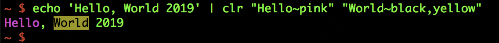
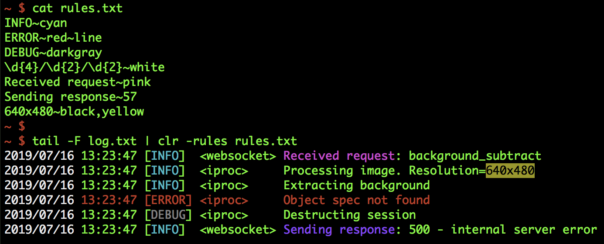

# clr - Output colorizer

`clr` is a command line output colorizer. Output from any command can be piped to `clr` and it'll highlight interesting portions of the output based on the given color rules.

#### Hello, World


#### Regex and more


## Installation

#### macOS
```
brew tap codeliveroil/apps
brew install clr
```

#### Other
Download the [latest release](/releases/latest) for your operating system and machine architecture. If one is not available, you can very easily [compile from source](#compile-from-source).

## Usage
```
clr -help
```

#### Examples
```console
tail -F log.txt | clr INFO~green ERROR~red
```

## Compile from source

### Setup
1. Install [Go](https://golang.org/)
1. Clone this repository

### Build for your current platform
```
make
make install
```

### Cross compile for a different platform
1. Build
	```
	make plat
	```
1. Follow the prompts and select a platform
1. The binary will be available in the `build` folder
